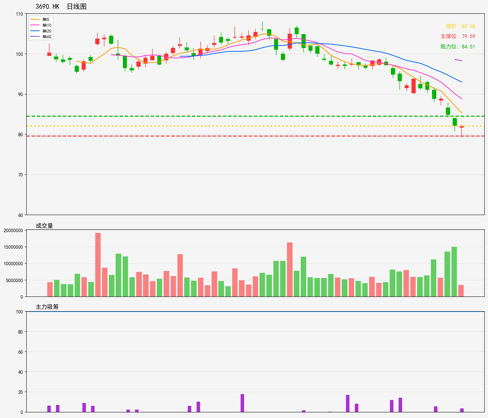

# 港股 - 持仓列表
## 3690.HK 技術分析報告
**生成時間**: 20260216

### 📊 核心技術指標
- 最新價格: 82.05
- 技術趨勢: 下降趋势
- MA20: 93.01 | MA60: 98.31
- RSI(14): 17.0 (超卖)
- 支撑位: 79.59 | 阻力位: 84.51

### 📝 AI超短線分析 (1-5日)
1. 趨勢總結：大趨勢向下，股價遠低於MA20、MA60，RSI處超賣區，短期有反抽潛力，但下降趨勢未改，反抽空間或受壓
2. 勝率：勝率約55%，超賣信號帶來短線反抽機會，但下降趨勢制約反彈高度，需嚴控風險
3. 情景分析：
   - 情景一：帶量突破84.51阻力，有望上試88-90區間，進一步挑戰MA20（93.01）
   - 情景二：跌破79.59支撐，將加速下探，下方暫無近距離明顯支撐，跌幅或擴大
4. 交易建議：超短線可於79.59-82區間輕倉低吸，止損設79.00以下，止盈先看84.51；若突破阻力則上調止盈至88附近，跌破支撐立即止損離場

### 🎧 語音版本
- 粵語版: [3690HK_cantonese_20260216.mp3](audio/3690HK_cantonese_20260216.mp3)
- 普通話版: [3690HK_mandarin_20260216.mp3](audio/3690HK_mandarin_20260216.mp3)

---

# Hong Kong Stocks - Holding List
## 3690.HK Technical Analysis Report
**Generated Time**: 20260216

### 📊 Core Technical Indicators
- Current Price: 82.05
- Technical Trend: Downtrend
- MA20: 93.01 | MA60: 98.31
- RSI(14): 17.0 (Oversold)
- Support Level: 79.59 | Resistance Level: 84.51

### 📝 AI Short-Term Analysis (1-5 Days)
1. Trend Summary  
Sustained downtrend with MA20 (93.01) and MA60 (98.31) acting as strong overhead resistance. RSI at 17.0 signals extreme oversold conditions, but this does not guarantee an immediate reversal—downtrend momentum remains dominant in the 1-5 day window.

2. Win Rate  
55% for short-term long (bounce play) due to oversold support; 65% for shorting on failed bounce attempts, given the robust downtrend and clear overhead resistance levels.

3. Scenario Analysis  
- Scenario 1 (Bounce): Price holds support at 79.59, triggers a relief bounce to resistance 84.51 within 2-3 days, driven by oversold buying. Trigger: Volume pickup above 83.0.  
- Scenario 2 (Downtrend Continuation): Support 79.59 breaks, price slides to 75-77 range in 3-5 days as selling pressure persists. Trigger: Low-volume bounce attempts followed by breakdown below 79.0.

4. Trading Advice  
- Bounce Play: Enter long at 81.5-82.0; stop loss below 79.0 (support break); take profit at 84.0-84.5 (resistance), exit within 3 days.  
- Short Play: Wait for price to test 83.5-84.0; enter short if it fails to break 84.51; stop loss above 85.0; take profit at 79.5-80.0, hold 2-5 days.  
- Avoid holding positions beyond 5 days to mitigate downtrend resumption risk.

### 🎧 Audio Version
- English Version: [3690HK_english_20260216.mp3](audio/3690HK_english_20260216.mp3)