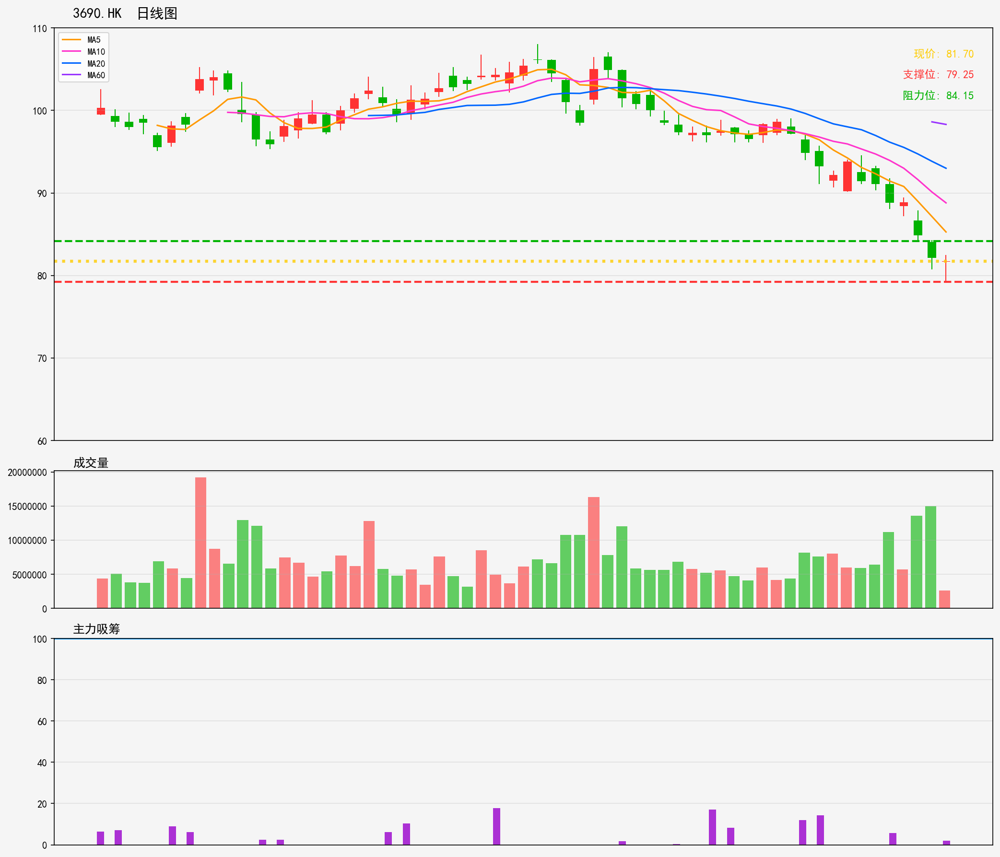
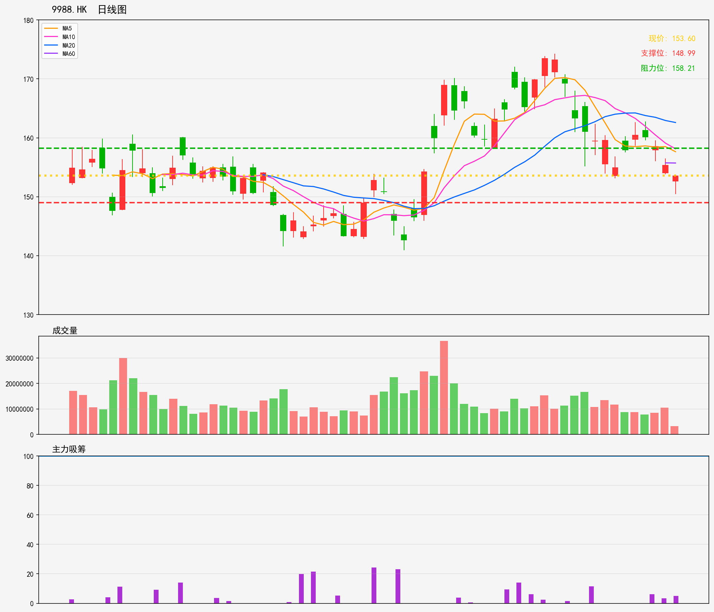
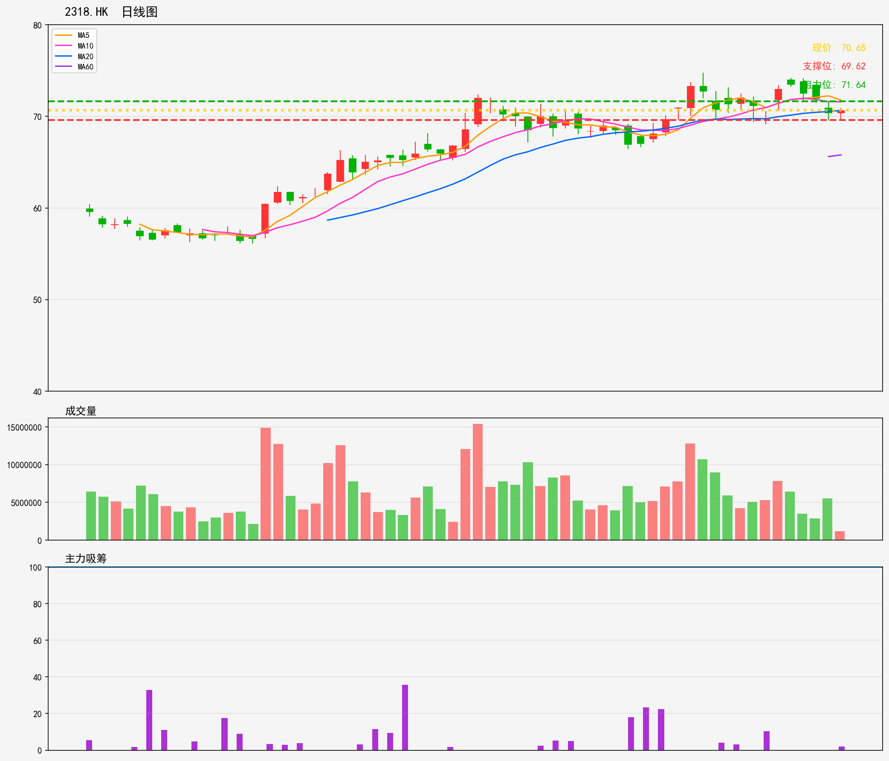
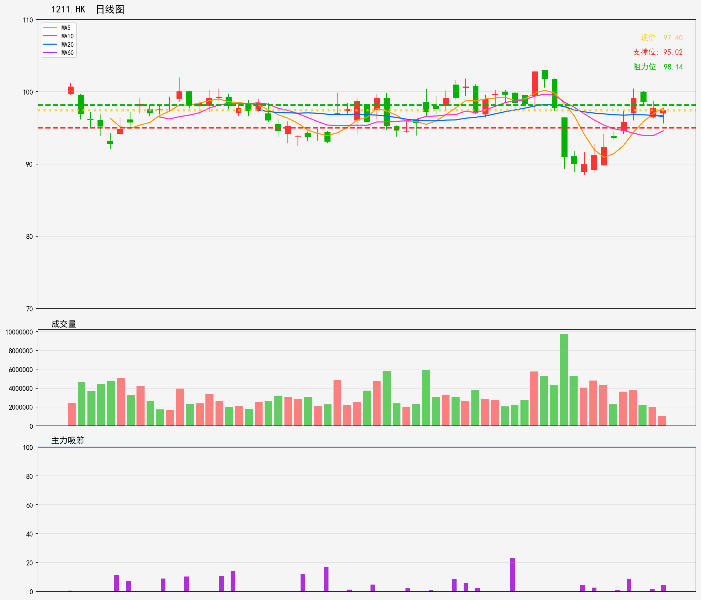
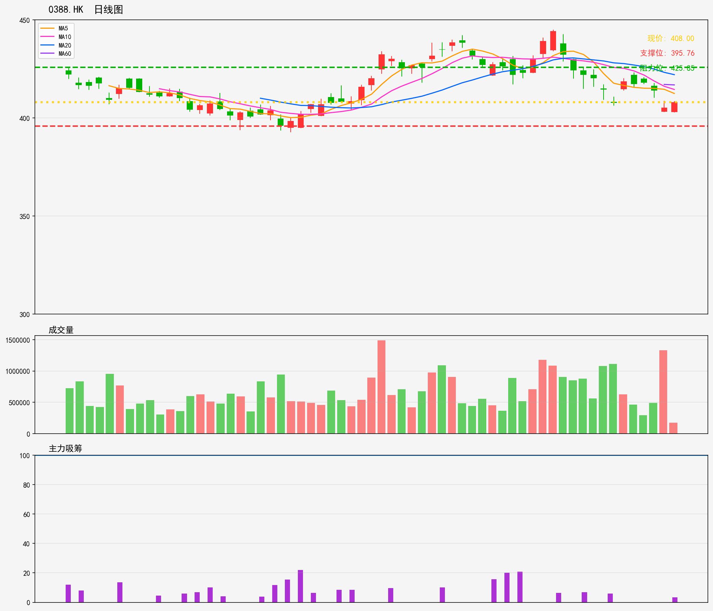
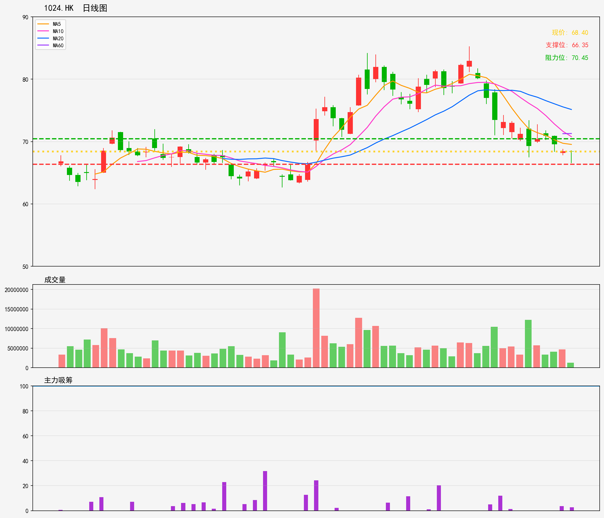

# 港股 - 持仓列表 分析报告
**生成时间**: 20260216
**分析股票数量**: 6

---

## 3690.HK

- 最新價格: 81.70
- 技術趨勢: 下降趋势
- MA20: 92.99 | MA60: 98.30
- RSI(14): 16.8 (超卖)
- 支撑位: 79.25 | 阻力位: 84.15

### 📝 AI超短線分析
1. 趨勢總結
呢只股目前處於明顯嘅下降趨勢，現價81.70遠低於MA20（92.99）同MA60（98.30），長短期均线都形成壓制；不過RSI指數16.8已經進入深度超賣區間，反映短期拋售力量接近枯竭，具備潛在嘅反彈動能，但大趨勢偏淡嘅格局暫時未改，反彈屬於短期修復性走勢。

2. 勝率
勝率約45%-50%，大趨勢偏淡限制咗反彈嘅空間同延續性，但超賣狀態提供咗短期博弈嘅切入窗口，屬於謹慎型嘅博弈機會，唔適合重倉參與。

3. 情景分析
情景一：短期反彈——若股價企穩於79.25支撐位上方，借助超賣觸發反彈，突破84.15阻力後，短期或上試86-88區間，但受MA20同下降趨勢嘅雙重壓制，反彈高度不宜高估，隨時有回落風險；
情景二：延續下跌——若股價跌破79.25支撐，代表超賣後仍無買盤承接，短期會繼續下探，下一個潛在支撐或睇76-77區間，拋售壓力將進一步釋放。

4. 交易建議
輕倉博弈短期反彈，進場位設於79.25-80.00區間，止損設於78.00（跌破支撐後立即離場，避免深套）；止盈分兩批執行：第一批於83.50-84.15區間止盈一半倉位，第二批若股價有效突破阻力，可持有至86-87區間再離場；若股價直接跌破79.25支撐，切勿急於抄底，以觀望為主，待出現明顯企穩信號（如連續兩日收陽、成交量放大）再考慮介入。

---

## 9988.HK

- 最新價格: 153.60
- 技術趨勢: 横盘整理
- MA20: 162.59 | MA60: 155.72
- RSI(14): 26.5 (超卖)
- 支撑位: 148.99 | 阻力位: 158.21

### 📝 AI超短線分析
1. 趨勢總結：9988.HK目前處於橫盤整理格局，股價現報153.6，低於MA60（155.72）同MA20（162.59），短期走勢偏軟，但RSI指數僅26.5，屬於明顯超賣區域，反映短期賣壓已經大致釋放，橫盤過程中出現超賣信號，具備技術性反彈的潛在動力。

2. 勝率：1-5日超短線勝率約65%。原因係超賣信號提供反彈催化劑，但上方MA60同阻力位158.21壓力唔小，而且整體橫盤格局未被打破，反彈空間或受限制，所以勝率中等偏上，需嚴格管控風險。

3. 情景分析：
   - 反彈情景：若股價受超賣推動啟動反彈，首先睇能否站穩MA60（155.72），如果順利突破，進一步挑戰上方阻力位158.21；若反彈力度不足，隨時會喺MA60附近遇阻回落，重回橫盤區間震盪。
   - 破位情景：若股價跌破支撐位148.99，則橫盤格局有向下破位嘅風險，短期走勢將轉弱，或進一步下探更低水平。

4. 交易建議：
   - 入場：可於現價153.6輕倉試注，或者等回踩支撐位148.99附近確認止跌後再加倉，總倉位控制喺2-3成以內，唔好太重倉。
   - 止盈：分階段止盈，第一目標先睇MA60（155.72），獲利約1.4%；第二目標挑戰阻力位158.21，獲利約3%，達標後分批止盈離場。
   - 止損：若股價跌破支撐位148.99，或者3個交易日入面冇見反彈跡象，立即止損離場，控制單筆虧損喺3%以內。

---

## 2318.HK

- 最新價格: 70.65
- 技術趨勢: 上升趋势
- MA20: 70.64 | MA60: 65.79
- RSI(14): 52.8 (中性)
- 支撑位: 69.62 | 阻力位: 71.64

### 📝 AI超短線分析
### 1. 趨勢總結
2318.HK目前處於上升趨勢框架內，現價70.65剛好企穩MA20（70.64），MA60（65.79）則在下方形成強力中期支撐。不過RSI指數處於52.8的中性區間，反映短期買賣力量相對均衡，暫未出現明顯超買或超賣信號，預計1-5日內大概率維持「震盪偏強」走勢，運行區間圍繞支撐69.62至阻力71.64展開。

### 2. 勝率
給予**60%勝率**。理由：上升趨勢未被破壞，MA20及MA60雙重支撐大幅降低短期深度回調風險；但RSI中性顯示動能不算強勁，且上方阻力位距離極近，短期突破難度不算低，因此勝率處於中等偏上水準，適合輕倉參與超短線操作。

### 3. 情景分析
- **情景一：突破阻力71.64**  
  若股價帶量突破71.64並收盤站穩，則短期動能將釋放，1-3日內有望上探72.2-72.5區間，超短線可看高一線。
- **情景二：跌破支撐69.62**  
  若股價有效跌破69.62（收盤價低於該價），則短期將下探68.5-69區間，需警惕進一步回測MA60支撐的風險。
- **情景三：區間震盪**  
  若維持在69.62-71.64區間內波動，則買賣力量持續均衡，超短線可執行「高拋低吸」策略。

### 4. 交易建議
- **進場策略**：現價70.65可輕倉介入（倉位1-2成），若回踩至69.8-70區間可加倉至3成；
- **止盈策略**：若突破71.64，止盈設於72.2；若維持震盪，則在71.3-71.5區間獲利了結；
- **止損策略**：有效跌破69.62則止損離場，止損價設於69.4（避免假跌破誤殺）；
- **備註**：超短線操作需緊盯盤面成交量，若突破阻力時成交量放大30%以上，可適度提高倉位至4成；若成交量持續萎縮，則及時獲利了結，勿戀戰。

---

## 1211.HK

- 最新價格: 97.40
- 技術趨勢: 横盘整理
- MA20: 96.57 | MA60: 96.72
- RSI(14): 48.4 (中性)
- 支撑位: 95.02 | 阻力位: 98.14

### 📝 AI超短線分析
1. 趨勢總結：呢隻1211.HK目前處於窄幅橫盤整理態勢，現價97.40企喺MA20（96.57）同MA60（96.72）上方，兩條移動平均線走近平行，反映短期多空力量均衡；RSI指數48.4處於中性區間，暫時冇明顯超買超賣信號，整體缺乏清晰嘅方向性指引。

2. 勝率：由於當前屬於橫盤震盪格局，多空僵持冇明顯趨勢傾向，1-5日超短線交易勝率約為50%，屬於中等水平，操作需嚴格執行止損止盈，避免被震盪洗走。

3. 情景分析：
   - 突破情景：若股價帶量有效突破阻力位98.14，短期上升空間將打開，目標可睇向100.00一線，需留意成交量是否持續放大確認突破有效性；
   - 破位情景：若股價跌破支撐位95.02，橫盤格局被打破，短期或向下測試93.00附近嘅次級支撐；
   - 震盪情景：若繼續維持橫盤，股價會喺95.02-98.14區間內反覆波動，多空雙方繼續僵持，難有大行情。

4. 交易建議：
   - 突破跟進：若股價帶量衝破98.14，可即時小倉追入，止損設於97.00（或MA20下方96.50），1-5日內見100.00附近即止盈；
   - 破位做空：若股價跌穿95.02，可反手做空，止損設於95.50，目標睇93.00；
   - 震盪高拋低吸：若維持橫盤，喺98.00阻力位附近沽出，95.00支撐位附近吸納，快進快出，1-5日內見利就走，唔好過度持倉。

---

## 0388.HK

- 最新價格: 408.00
- 技術趨勢: 横盘整理
- MA20: 422.06 | MA60: 416.84
- RSI(14): 35.9 (中性)
- 支撑位: 395.76 | 阻力位: 425.85

### 📝 AI超短線分析
1. 趨勢總結
目前處於橫盤整理階段，現價408元低於MA20（422.06元）同MA60（416.84元），短期均線呈現明顯壓制態勢；RSI指數35.9處於中性區間，反映買賣雙方力量暫時均衡，但價格偏於弱勢橫盤格局，支撐阻力邊界清晰。

2. 勝率
勝率約55%-60%。由於橫盤區間支撐阻力明確，便於制定交易策略，但短期均線壓制未解除，買方動能未見明顯釋放，所以勝率處於中等偏上水平，核心需關注支撐位的防守強度同成交量變化。

3. 情景分析
- 向上突破情景：若股價帶量突破阻力位425.85元，同時上穿MA20與MA60，則短期弱勢格局有望扭轉，買方動能開始釋放，短期目標可看至435-440元區間，需確認成交量持續放大配合。
- 向下破位情景：若股價跌破支撐位395.76元，且RSI進一步回落至30以下進入超賣區，則橫盤格局宣告破位，短期或下探385-390元區間，弱勢態勢將延續。
- 橫盤震盪情景：若股價維持在395.76-425.85元區間內震盪，則買賣雙方力量繼續均衡，此時適合高拋低吸操作，靠近支撐吸納、靠近阻力止盈。

4. 交易建議
1. 入場策略：現價408元可輕倉試入（倉位建議1-2成）；或等待股價回踩至支撐位395.76元附近，確認止跌信號（如十字星、小陽線）後再加倉至3成以內，避免重倉。
2. 止盈策略：若股價上漲至420-425元區間（靠近阻力位）獲利止盈；若成功突破425.85元並站穩，則持有至435元附近再止盈。
3. 止損策略：若股價跌破支撐位395.76元且收盤價確認破位，則及時止損，止損空間約3%，避免損失擴大。
4. 操作提醒：1-5日超短線需每日跟蹤成交量同均線走勢，同時關注港股大市及金融板塊整體表現，若大市走弱需提前降低倉位。

---

## 1024.HK

- 最新價格: 68.40
- 技術趨勢: 横盘整理
- MA20: 75.14 | MA60: 71.29
- RSI(14): 26.3 (超卖)
- 支撑位: 66.35 | 阻力位: 70.45

### 📝 AI超短線分析
1. 趨勢總結：呢隻1024.HK目前處於橫盤整理態勢，現價68.40喺MA60（71.29）同MA20（75.14）下方，反映短期走勢偏弱，但RSI指數去到26.3嘅超賣水平，顯示短期賣壓已經釋放得七七八八，有技術性反彈嘅潛力，整體屬於「弱勢橫盤+超賣信號」嘅組合。

2. 勝率：考慮到超賣帶來嘅反彈動能，加上下方有66.35嘅明確支撐，短期做多嘅勝率約65%；但由於上方有MA60同阻力位70.45嘅雙重壓制，反彈空間唔會太大，要隨時留意獲利回吐壓力。

3. 情景分析：
   - 情景一（反彈走勢）：若後市受超賣推動向上，先挑戰70.45阻力位，有效突破嘅話有望進一步測試MA60嘅71.29水平，呢個時候可以繼續持有睇更高；
   - 情景二（破位走勢）：如果跌破66.35嘅支撐位，代表橫盤態勢被打破，短期走勢會進一步轉弱，隨時有向下尋底嘅可能；
   - 情景三（橫盤震盪）：喺66.35至70.45區間內來回波動，呢個時候可以做高拋低吸，超短線快進快出，唔好戀戰。

4. 交易建議：超短線操作嘅話，依家可以輕倉試建多倉，入場價參考現價68.40附近；止損位設喺支撐位下方，比如66.00，一旦跌破就止損離場，避免虧損擴大；目標價先睇70.45阻力位，若能有效突破，可上調目標至MA60嘅71.29；如果後市直接跌破66.35支撐，就唔好執念，及時止損走貨。

---
