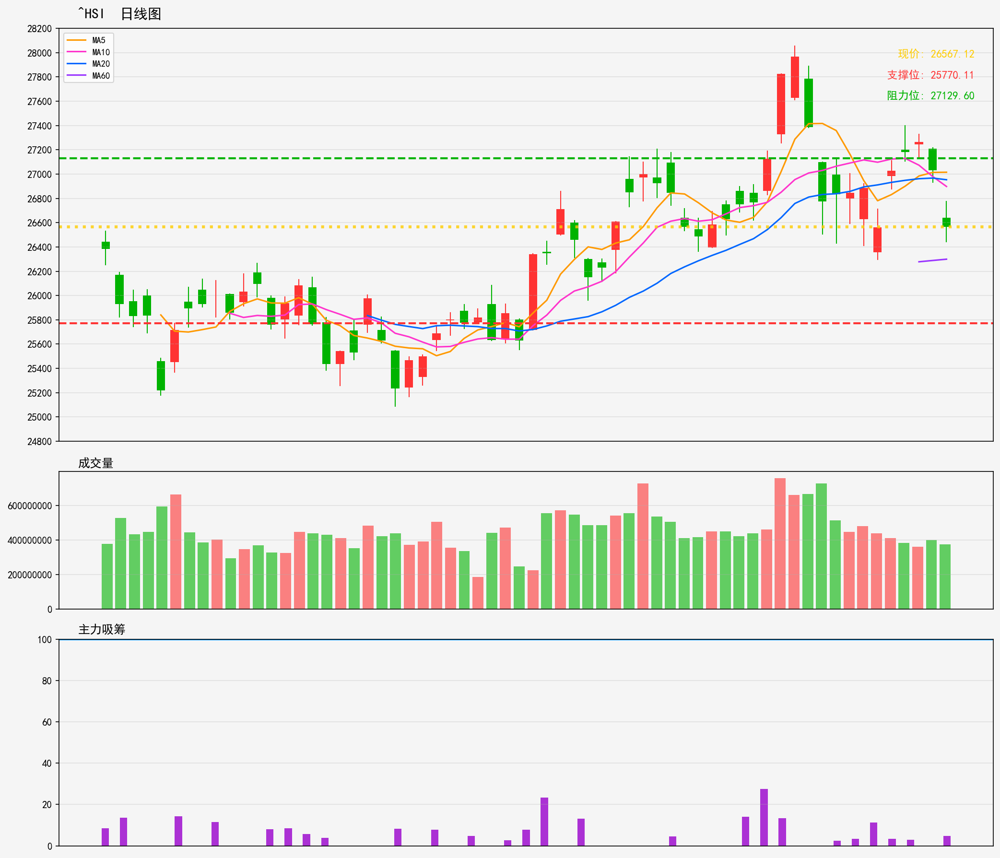

# 港股 - 市场指数 分析报告
**生成时间**: 20260216
**分析股票数量**: 2

---

## ^HSI

- 最新價格: 26567.12
- 技術趨勢: 横盘整理
- MA20: 26953.49 | MA60: 26299.27
- RSI(14): 47.7 (中性)
- 支撑位: 25770.11 | 阻力位: 27129.6

### 📝 AI超短線分析
1. 趨勢總結：
恒指目前處於橫盤整理階段，現價26567介乎MA20（26953）與MA60（26299）之間，RSI報47.7屬中性水平，暫未出現明顯多空趨勢。上方短期阻力見27129，下方先有MA60作為支撐，進一步支撐則為25770，整體維持區間震盪格局，多空力量暫時均衡。

2. 勝率：
當前屬無明顯趨性的震盪市，多空博弈均衡，超短線1-5日交易勝率約50-55%。由於震盪市容易出現反覆洗盤，需嚴格執行止損止盈規則，否則容易被行情吞噬獲利。

3. 情景分析：
- 向上突破情景：若股價有效突破27129阻力位（且成交量配合放大），則短期多頭動能釋放，震盪格局有望打破，短期目標可看27500附近，後續或延續小級別上升趨勢。
- 向下破位情景：若股價跌破MA60（26299）支撐，則空頭力量佔優，大概率下探進一步支撐25770，短期走勢轉弱。
- 區間震盪情景：若股價繼續在MA20與MA60之間來回波動，則維持高拋低吸節奏，無明顯趨性可言，獲利空間受限。

4. 交易建議：
- 區間震盪操作：當股價靠近MA20（26900-27000區間）可輕倉做空，止損設在27130上方，止盈看26500-26600；當股價靠近MA60（26300-26400區間）可輕倉做多，止損設在26290下方，止盈看26900-27000。
- 突破跟進操作：若股價收盤有效突破27129，可追入多單，止損設在27000下方，目標看27500；若股價收盤跌破26299，可追入空單，止損設在26350上方，目標看25770。
- 風險控制：超短線交易倉位建議不超過3成，震盪市避免過度持倉，一旦走勢偏離預期，立即執行止損離場，勿抱有僥倉心理。

---

## 2800.HK

- 最新價格: 26.88
- 技術趨勢: 横盘整理
- MA20: 27.16 | MA60: 26.51
- RSI(14): 44.7 (中性)
- 支撑位: 26.76 | 阻力位: 27.35

### 📝 AI超短線分析
1. 趨勢總結：目前2800.HK處於橫盤整理格局，現價26.88介乎MA20（27.16）與MA60（26.51）之間，屬於窄幅區間震盪狀態；RSI指數44.7處於中性區域，暫未出現明顯超買或超賣信號，短期缺乏明確單邊趨勢，主要以區間內波動為主。
2. 勝率：基於當前橫盤震盪格局，區間內高拋低吸的操作勝率約60%；若出現有效突破行情（連續兩小時收盤站穩阻力/跌破支撐），勝率可提升至65%-70%，假突破情況下勝率會降至4成以下，需嚴格篩選信號。
3. 情景分析：
   - 向上突破情景：若股價連續收盤站穩阻力位27.35且成交量同步放大，確認突破有效，短期目標可看27.80附近，後續關注28.00整數壓力；
   - 向下破位情景：若股價跌破支撐位26.76且無法快速收回，震盪格局被打破，短期下探目標看26.20一帶，進一步觀察MA60下方26.00支撐力度；
   - 橫盤震盪情景：若股價維持在26.76-27.35區間內波動，則以區間內高拋低吸為主，不追漲殺跌，避免過度持有。
4. 交易建議：
   - 現價26.88接近區間下沿支撐，可小倉位（建議總倉位1-2成）試多，止損設在26.60（支撐下方0.16元，規避假破位掃單），止盈先看區間上沿27.35；
   - 若股價連續收盤站穩27.35，可加倉至3成，止損上移至27.10，進一步止盈看27.80；
   - 若股價跌破26.76且半小時內無法收回，則反手開空，止損設在26.90，止盈看26.20；
   - 超短線操作需嚴格執行止損止盈，倉位不宜過重，快進快出，避免因橫盤震盪拖延持有時間。

---
