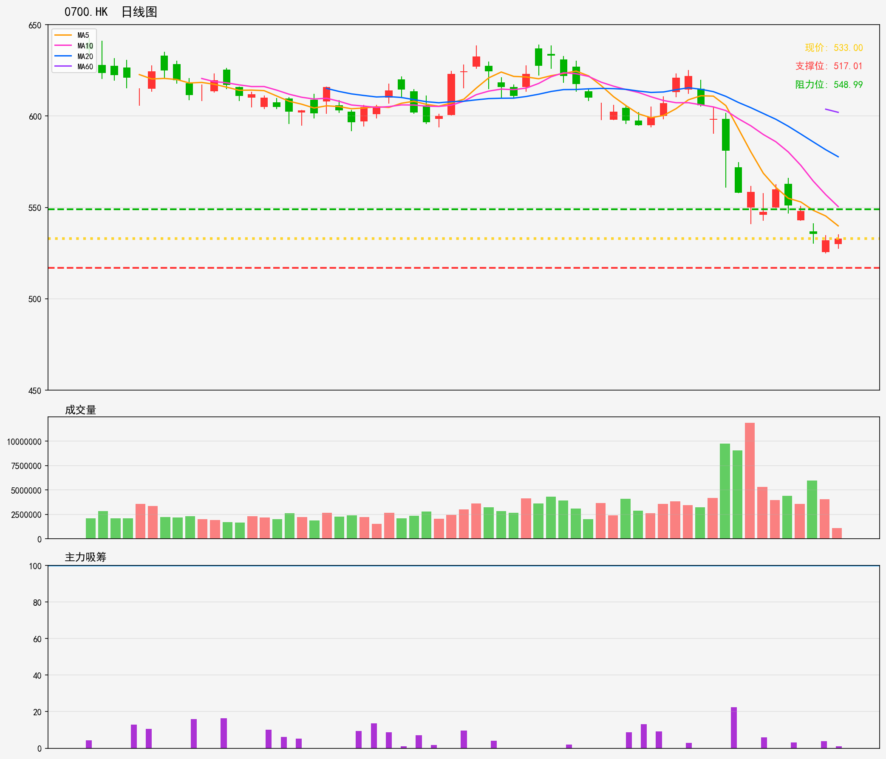

# 港股 - 强势趋势股
## 0700.HK 技術分析報告
**生成時間**: 20260216

### 📊 核心技術指標
- 最新價格: 533.00
- 技術趨勢: 下降趋势
- MA20: 577.73 | MA60: 602.03
- RSI(14): 22.0 (超卖)
- 支撑位: 517.01 | 阻力位: 548.99

### 📝 AI超短線分析 (1-5日)
1. 趨勢總結：處於下降趨勢，MA20、MA60呈空頭排列，RSI達22進入超賣區，短期有反彈潛能但大趨勢偏弱。
2. 勝率：約55%，超賣帶來短線反彈機會，但下降趨勢壓制反彈空間，勝率中等。
3. 情景分析：
   - 情景1：受超賣推動反彈，挑戰548.99阻力位，無法突破則反彈見頂回落。
   - 情景2：失守517.01支撐，將延續下降趨勢，進一步下探空間打開。
4. 交易建議：輕倉（倉位≤10%）博短線反彈，止盈設548.99，止損設515（支撐下方）；若跌破517.01立即止損離場，勿盲目抄底。

### 🎧 語音版本
- 粵語版: [0700HK_cantonese_20260216.mp3](audio/0700HK_cantonese_20260216.mp3)
- 普通話版: [0700HK_mandarin_20260216.mp3](audio/0700HK_mandarin_20260216.mp3)

---

# Hong Kong Stocks - Strong Trend Stocks
## 0700.HK Technical Analysis Report
**Generated Time**: 20260216

### 📊 Core Technical Indicators
- Current Price: 533.00
- Technical Trend: Downtrend
- MA20: 577.73 | MA60: 602.03
- RSI(14): 22.0 (Oversold)
- Support Level: 517.01 | Resistance Level: 548.99

### 📝 AI Short-Term Analysis (1-5 Days)
1. Trend Summary  
Short-term downtrend remains intact, with price trading significantly below MA20 (577.73) and MA60 (602.03). However, extreme oversold RSI (22) creates conditions for a near-term relief rally, though broader downward momentum remains dominant.  

2. Win Rate  
Moderate 55% win rate. Oversold RSI supports bounce potential, but the prevailing downtrend and overhead resistance limit the sustainability of gains in the 1-5 day window.  

3. Scenario Analysis  
- Bullish: Oversold conditions trigger short covering, driving price to test immediate resistance at 548.99 within 2-3 days. A break above may extend gains to 555, but MA20 (577) is out of reach in the short term.  
- Bearish: Downtrend resumes, breaking support at 517.01 without bullish catalysts. Further downside to 500 is likely within 3-5 days as selling pressure persists.  

4. Trading Advice  
- Aggressive entry: Go long at 533, set stop-loss at 520 (2.4% risk) and take-profit at 548 (2.8% upside).  
- Conservative entry: Wait for price to test 517 support, then go long with stop-loss below 510, target 548.  
- Exit within 5 days; close positions immediately if price fails to hit resistance or breaks support, as downtrend risks persist.

### 🎧 Audio Version
- English Version: [0700HK_english_20260216.mp3](audio/0700HK_english_20260216.mp3)