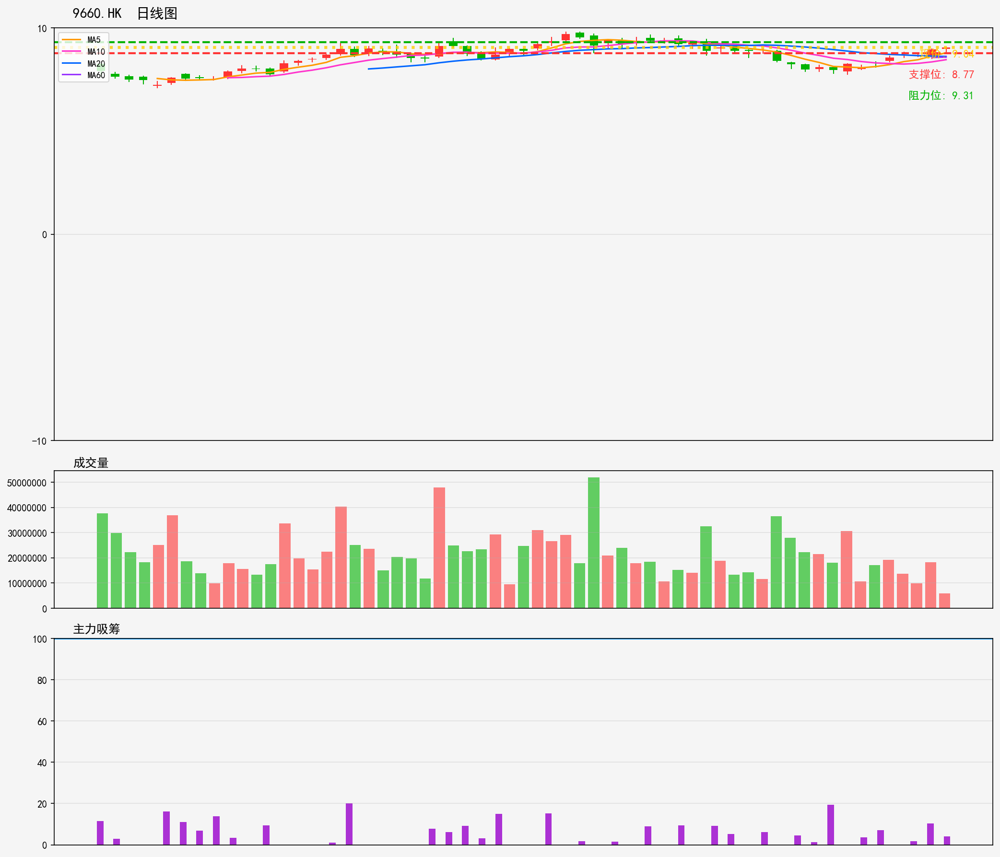

# 港股 - 观察列表
## 9660.HK 技術分析報告
**生成時間**: 20260216

### 📊 核心技術指標
- 最新價格: 9.04
- 技術趨勢: 上升趋势
- MA20: 8.62 | MA60: 8.58
- RSI(14): 53.0 (中性)
- 支撑位: 8.77 | 阻力位: 9.31

### 📝 AI超短線分析 (1-5日)
1. 趨勢總結
現處上升趨勢，MA20（8.62）、MA60（8.58）於現價下方形成雙重支撐，RSI中性未見超買，短期走勢偏穩但動能不算充足。

2. 勝率
65%，上升趨勢下支撐明確，但阻力位（9.31）與現價距離較近，獲利空間受限，勝率屬中等偏上。

3. 情景分析
- 突破情景：若放量突破9.31阻力，1-5日內有望上試9.5-9.6區間，趨勢延續動能增強；
- 破位情景：若失守8.77支撐，將回測MA20（8.62），短期上升趨勢或轉弱。

4. 交易建議
輕倉介入，止蝕設8.70（低於支撐位防假破位），止盈先看9.30；若突破阻力則上調止盈至9.50，5日內未達止盈則獲利了結。

### 🎧 語音版本
- 粵語版: [9660HK_cantonese_20260216.mp3](audio/9660HK_cantonese_20260216.mp3)
- 普通話版: [9660HK_mandarin_20260216.mp3](audio/9660HK_mandarin_20260216.mp3)

---

# Hong Kong Stocks - Watch List
## 9660.HK Technical Analysis Report
**Generated Time**: 20260216

### 📊 Core Technical Indicators
- Current Price: 9.04
- Technical Trend: Uptrend
- MA20: 8.62 | MA60: 8.58
- RSI(14): 53.0 (Neutral)
- Support Level: 8.77 | Resistance Level: 9.31

### 📝 AI Short-Term Analysis (1-5 Days)
1. Trend Summary  
Short-term uptrend remains intact: current price (9.04) trades above MA20 (8.62) and MA60 (8.58), confirming bullish momentum. RSI (53.0) is neutral, with no immediate overbought pressure. Key support sits at 8.77, and immediate resistance at 9.31.  

2. Win Rate  
65-70%. The uptrend above critical moving averages provides a favorable bias, but neutral RSI and proximity to resistance introduce mild consolidation risk, limiting the edge slightly.  

3. Scenario Analysis  
- Bullish: A volume-driven breakout (20%+ above average volume) above 9.31 resistance targets 9.60 within 3-5 days, as momentum extends the uptrend.  
- Bearish: A breakdown below 8.77 support triggers a pullback to MA20 (8.62); if MA20 fails, the next floor is MA60 (8.58), signaling a temporary trend pause.  

4. Trading Advice  
- Entry: Enter at current 9.04 or on a shallow pullback to 8.90.  
- Stop Loss: Set below 8.77 (≈3% risk from entry) to exit on support violation.  
- Take Profit: Lock in gains at 9.31 first; if resistance breaks, trail stop to 9.10 and target 9.60.  
- Key Cue: Monitor volume closely to validate breakout/breakdown signals before adjusting positions.

### 🎧 Audio Version
- English Version: [9660HK_english_20260216.mp3](audio/9660HK_english_20260216.mp3)