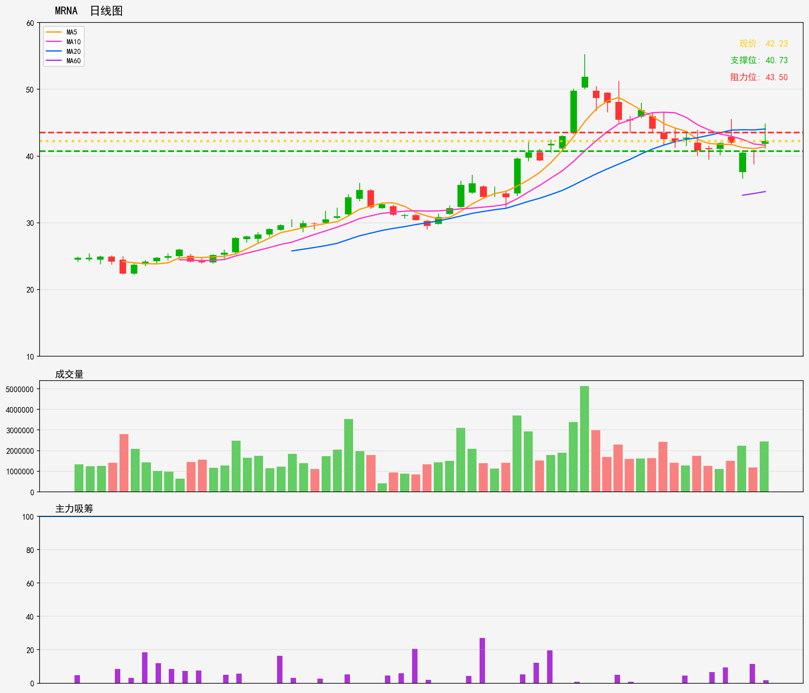
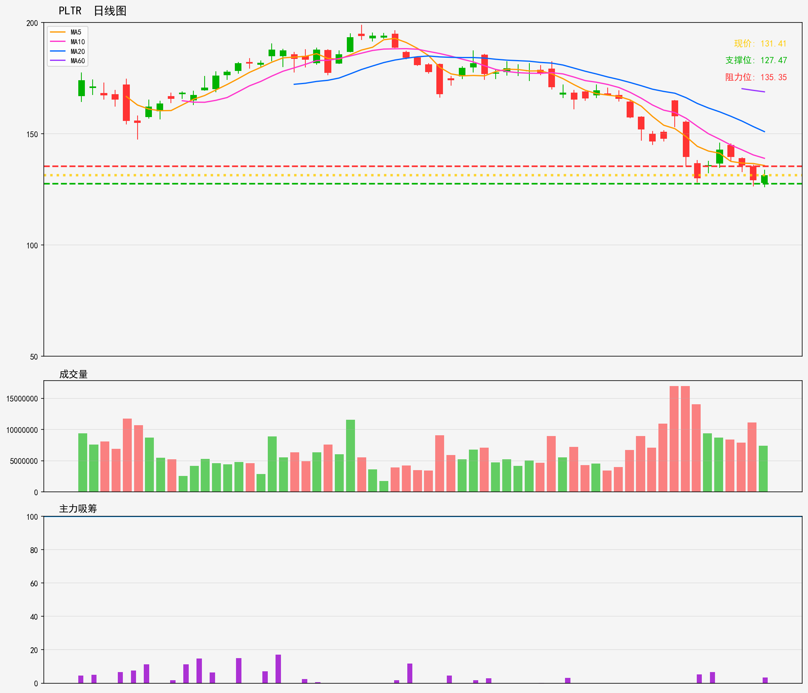
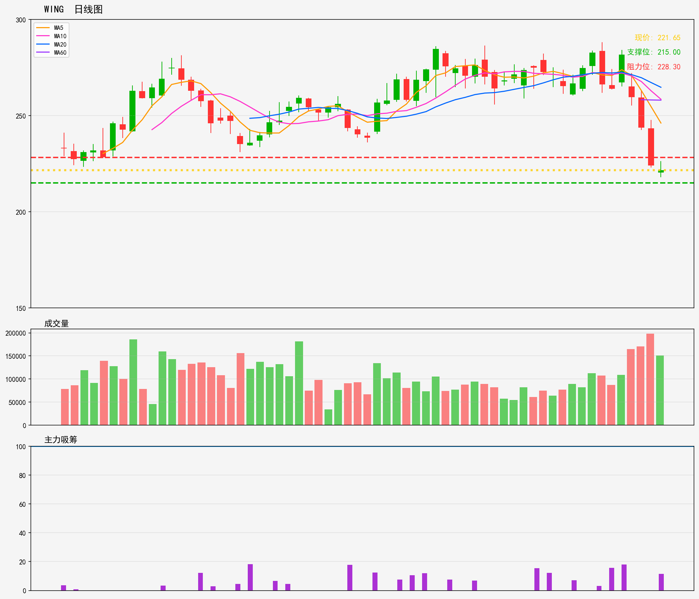

# 美股 - 持仓列表 分析报告
**生成时间**: 20260216
**分析股票数量**: 3

---

## MRNA

- 最新價格: 42.23
- 技術趨勢: 横盘整理
- MA20: 44.05 | MA60: 34.67
- RSI(14): 32.6 (中性)
- 支撑位: 40.73 | 阻力位: 43.5

### 📝 AI超短線分析
1. 趨勢總結
MRNA目前處於橫盤整理態勢，現價42.23位於MA20（44.05）下方，短期受移動平均線壓制，而MA60（34.67）則在遠處提供較強的中期支撐。RSI指數32.6處於中性區間偏弱水平，未進入超賣，但顯示買盤動能暫時不足，整體1-5日內維持區間震盪的概率較高。

2. 勝率
基於當前明確的支撐阻力邊界、RSI未過度超賣的狀態，加上橫盤震盪格局下的高拋低吸空間，1-5日超短線交易勝率約為60-65%，震盪區間內操作的獲利機會略高於突破風險。

3. 情景分析
- 突破情景：若股價有效突破阻力位43.50（連續2小時收盤站穩或單日成交量放大超過20%），則短期趨勢有望轉強，目標可先看至MA20的44.05，進一步帶量突破則上望45.00附近。
- 破位情景：若股價跌破支撐位40.73且成交量同步放大，則震盪格局被打破，短期將測試40.00關口甚至MA60（34.67）上方區域，需及時止損離場避免擴大虧損。
- 震盪情景：若股價維持在40.73-43.50區間內波動，則可在區間下沿（41.00以下）低吸，上沿（43.00以上）高拋，賺取區間差價為主。

4. 交易建議
- 入場策略：現價42.23靠近區間下沿支撐，可輕倉（倉位建議10-15%）介入，等待反彈測試阻力。
- 止損設置：將止損價設在40.70下方（跌破支撐位後確認破位，避免假破位誤判），單筆交易虧損控制在總資金的1%以內。
- 止盈策略：若股價反彈至43.30-43.50區間，可先獲利止盈50%倉位；若有效突破43.50，則持有剩餘倉位看至44.05（MA20位置），屆時再評估是否延長持有。
- 注意事項：若股價漲至43.50阻力位時成交量未明顯放大，切勿追高，優先選擇獲利了結或等待回調確認支撐後再考慮介入。

---

## PLTR

- 最新價格: 131.41
- 技術趨勢: 下降趋势
- MA20: 150.95 | MA60: 168.85
- RSI(14): 29.7 (超卖)
- 支撑位: 127.47 | 阻力位: 135.35

### 📝 AI超短線分析
1. 趨勢總結
PLTR目前處於明顯的中短期下降趨勢，股價遠低於20日（150.95）及60日（168.85）移動平均線，反映大方向偏弱。不過RSI指數來到29.7的超賣區間，顯示短期賣壓已有所釋放，加上股價接近下方127.47支撐位，具備技術性反彈的潛力，但上方阻力較近，反彈空間暫時受限。

2. 勝率
勝率約55%-60%。雖然大趨勢向下，但超賣信號疊加接近支撐位，短線反彈的觸發機會提升；不過上方135.35阻力與現價距離較近，且下降趨勢未扭轉，反彈動力可能被快速消耗，因此勝率處於中等偏上水平。

3. 情景分析
情景一：技術性反彈行情
若股價企穩127.47支撐後啟動反彈，並有效突破135.35阻力位（收盤價站穩），則短期反彈動力加強，有望進一步測試140-142區域（20日均線下方的弱阻力帶），此時超賣後的技術修復行情延續。

情景二：趨勢延續下行
若股價跌破127.47支撐位（收盤價確認跌破），則下降趨勢繼續強化，短期目標看122-124區域，賣壓將進一步釋放，無明顯反彈信號前不宜抄底。

情景三：區間震盪走勢
這是最可能出現的短期情景：股價在127.47-135.35區間內震盪整理，多空雙方在超賣信號與下降趨勢之間拉扯，反彈到阻力位就遇壓回落，跌到支撐位就獲得承接，震盪時間約2-3個交易日。

4. 交易建議
- 入場策略：在128.00-130.00區間分批建倉，利用支撐位附近的超賣機會布局短線反彈，倉位控制在總資金的8%-10%，避免大倉位對抗大趨勢。
- 止損設置：當股價收盤價有效跌破127.47時，立即止損出局，單筆交易風險控制在總資金的2%-3%以內。
- 止盈設置：第一止盈位設為135.35阻力位，獲利空間約4%-5%；若股價突破135.35並穩企超過1個交易日，則上調止盈至140.00附近，獲利約7%-8%。
- 備註：若股價在入場區間內震盪超過2個交易日未啟動反彈，建議減半倉位觀望，避免浪費資金效率。

---

## WING

- 最新價格: 221.65
- 技術趨勢: 横盘整理
- MA20: 264.74 | MA60: 258.05
- RSI(14): 29.2 (超卖)
- 支撑位: 215.0 | 阻力位: 228.3

### 📝 AI超短線分析
1. 趨勢總結：呢隻WING目前處於橫盤整理態勢，但股價明顯低於MA20（264.74）同MA60（258.05）兩條均線，反映中線層面仍然偏弱；不過RSI指數來到29.2嘅超賣區間，代表短期賣壓已經釋放得相當充分，具備反彈嘅潛在動力，而家股價就夾喺215.00嘅支撐位同228.30嘅阻力位之間窄幅上落。

2. 勝率：大約60%。理由係RSI超賣狀態提供咗短期反彈嘅催化劑，橫盤區間嘅支撐位亦有一定承接力；但中線均線嘅壓力唔可以忽視，反彈空間隨時會被壓制，所以勝率屬於中等偏上水平，適合謹慎布局超短線。

3. 情景分析：
   - 情景一：股價突破228.30阻力位並穩企半小時以上，代表買盤力量突顯，有機會挑戰上方嘅短期壓力區（大約235-240區間，靠近MA60下沿），呢個時候可以持有倉位睇更高目標。
   - 情景二：股價跌破215.00支撐位並收市低於呢個價位，代表承接力完全失效，短期走勢進一步轉弱很大機會下探205-210嘅新一輪潛在支撐，呢個時候要及時止損離場，唔好硬扛。
   - 情景三：股價繼續喺215-228區間橫盤震蕩，呢個時候可以採取高拋低吸策略，喺支撐位附近輕倉吸貨，阻力位附近及時止盈，唔好戀戰。

4. 交易建議：
   - 入場點：建議喺215-218區間低吸，趁超賣信號同支撐位嘅承接力布局超短線倉位。
   - 止損位：設喺213.00下方，一旦跌破代表支撐失效，及時斬倉避免損失擴大。
   - 止盈位：第一目標睇228.30嘅阻力位，到價可以先止盈一半倉位；如果突破阻力並穩企，再將剩餘倉位嘅止盈上調到235附近（靠近MA60下沿）。
   - 倉位控制：由於中線走勢仍然偏弱，建議倉位控制在總資金嘅1-2成，符合1-5日超短線嘅風險管理要求，唔好過重倉。

---
