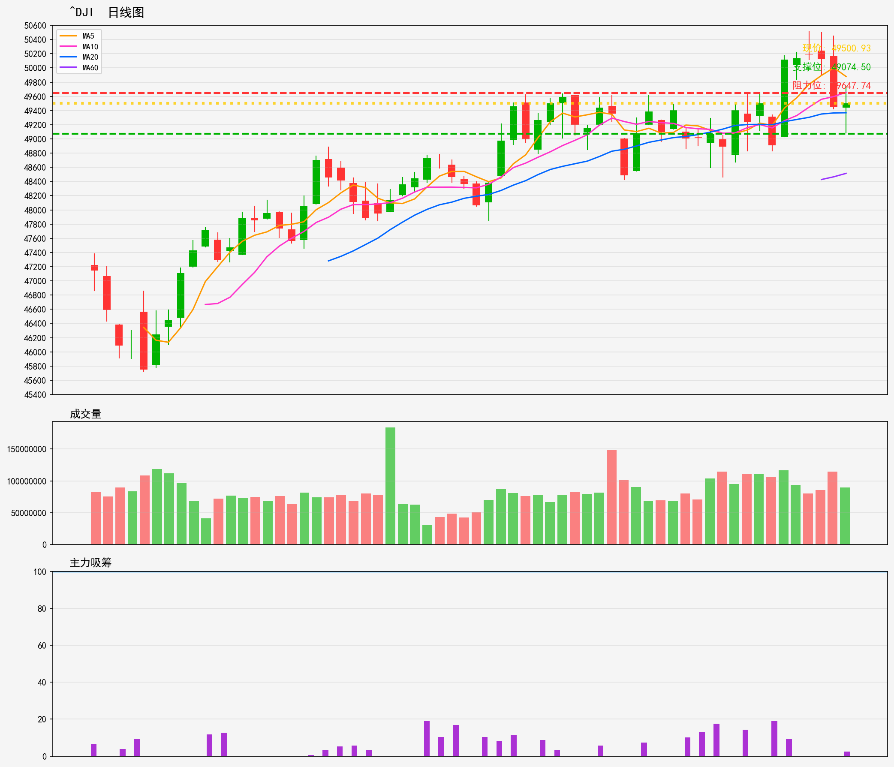

# 美股 - 市场指数
## ^DJI 技術分析報告
**生成時間**: 20260216

### 📊 核心技術指標
- 最新價格: 49500.93
- 技術趨勢: 上升趋势
- MA20: 49368.80 | MA60: 48514.76
- RSI(14): 51.0 (中性)
- 支撑位: 49074.5 | 阻力位: 49647.74

### 📝 AI超短線分析 (1-5日)
1. 趨勢總結：短期處上升趨勢，現價企於MA20之上，MA20亦在MA60上方呈多頭排列，但RSI處中性區，上升動力暫未過強，現價接近上方阻力位。
2. 勝率：60%
3. 情景分析：① 若突破49647阻力並企穩，短期有望進一步上衝；② 若遇阻回落，先看MA20（49368）支撐，失守則下看49074關口。
4. 交易建議：現價接近阻力不建議追高，可待回落至MA20附近（約49370）小倉低吸，或突破阻力企穩後輕倉跟進；止損設於49070下方，目標先看49650，獲利約50點可先減半倉。

### 🎧 語音版本
- 粵語版: [^DJI_cantonese_20260216.mp3](audio/^DJI_cantonese_20260216.mp3)
- 普通話版: [^DJI_mandarin_20260216.mp3](audio/^DJI_mandarin_20260216.mp3)

---

# US Stocks - Market Index
## ^DJI Technical Analysis Report
**Generated Time**: 20260216

### 📊 Core Technical Indicators
- Current Price: 49500.93
- Technical Trend: Uptrend
- MA20: 49368.80 | MA60: 48514.76
- RSI(14): 51.0 (Neutral)
- Support Level: 49074.5 | Resistance Level: 49647.74

### 📝 AI Short-Term Analysis (1-5 Days)
1. Trend Summary  
Short-term uptrend remains intact: ^DJI trades above both MA20 (49368.80) and MA60 (48514.76), confirming upward momentum. RSI at 51.0 is neutral, meaning no immediate overbought/oversold pressure, leaving room for further movement within the trend.

2. Win Rate  
65-70% for bullish setups. Favorable trend alignment (price above key MAs) and neutral RSI support high-probability upward continuation, though proximity to immediate resistance (49647.74) introduces moderate risk of a pullback if the breakout fails.

3. Scenario Analysis  
- Bullish Breakout: Price closes above 49647.74 with increased volume → Extend uptrend toward 50,000 in 3-5 days.  
- Resistance Rejection: Fails to breach resistance, then drops below 49074.50 support → Test MA60 (48514.76) in 2-4 days, signaling a short-term trend pause.  
- Consolidation: Sideways trading between support and resistance for 1-2 days before resolving direction, likely favoring the uptrend if support holds.

4. Trading Advice  
- Existing Longs: Trail stop-loss to $49,300 (just below MA20) to lock in gains; take partial profits at 49647.74 if momentum weakens.  
- New Entries: Avoid chasing current price near resistance. Wait for a pullback to 49074.50 with bullish confirmation (e.g., bounce on volume, hammer candlestick) to enter long, targeting 49647.74 first, then 50,000.  
- Short Setup: Only consider shorting if price breaks below 49074.50 with volume; place stop-loss above 49200, target MA60 (48514.76).

### 🎧 Audio Version
- English Version: [^DJI_english_20260216.mp3](audio/^DJI_english_20260216.mp3)