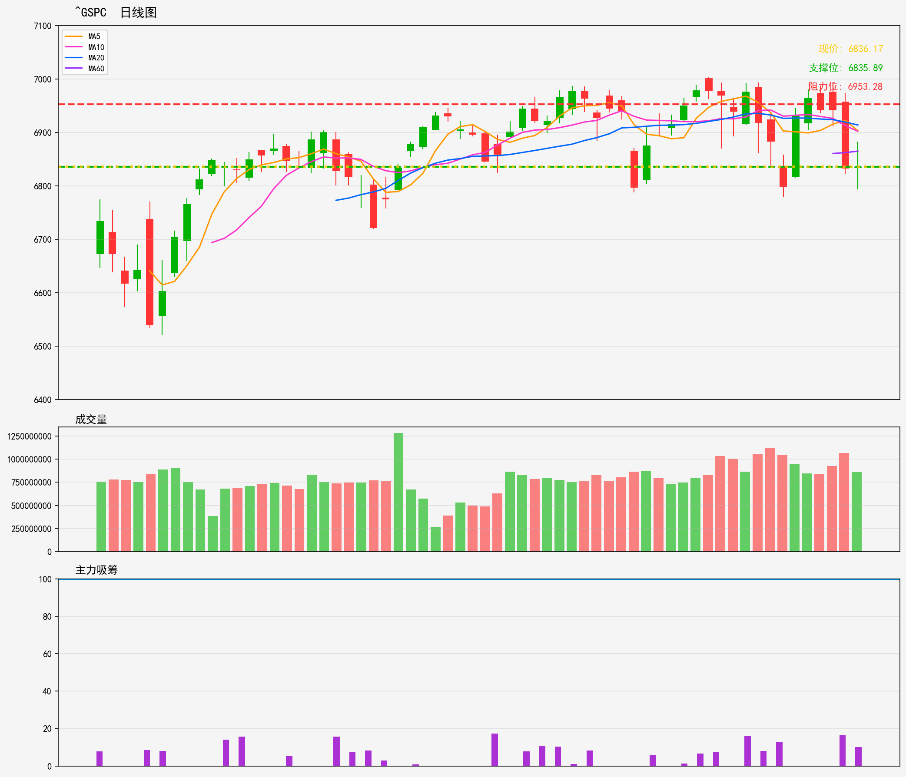

# 美股 - 市场指数
## ^GSPC 技術分析報告
**生成時間**: 20260216

### 📊 核心技術指標
- 最新價格: 6836.17
- 技術趨勢: 横盘整理
- MA20: 6914.05 | MA60: 6865.13
- RSI(14): 40.3 (中性)
- 支撑位: 6835.89 | 阻力位: 6953.28

### 📝 AI超短線分析 (1-5日)
1. 趨勢總結：現處橫盤整理格局，現價貼近下方支撐6835.89，已跌穿MA60（6865），MA20（6914）在上方構成壓力，RSI40.3處中性區，暫無明顯單邊趨勢，焦點在支撐位攻防。
2. 勝率：支撐位附近試多勝率約6成，橫盤格局下支撐有效性待確認，風險回報比尚可。
3. 情景分析：
   - 情景一：守住6835支撐，RSI隨反彈回升，有望先測MA60（6865），強勢可挑戰阻力6953；
   - 情景二：跌破6835支撐，橫盤格局打破，短期下探空間打開，目標看向6780一帶。
4. 交易建議：
   - 支撐位6835附近輕倉試多，止蝕設6810，目標分兩級：先看6865（MA60），突破再上看6890；
   - 若跌破6835，反手輕倉做空，止蝕設6855，目標看6780。

### 🎧 語音版本
- 粵語版: [^GSPC_cantonese_20260216.mp3](audio/^GSPC_cantonese_20260216.mp3)
- 普通話版: [^GSPC_mandarin_20260216.mp3](audio/^GSPC_mandarin_20260216.mp3)

---

# US Stocks - Market Index
## ^GSPC Technical Analysis Report
**Generated Time**: 20260216

### 📊 Core Technical Indicators
- Current Price: 6836.17
- Technical Trend: Sideways Trend
- MA20: 6914.05 | MA60: 6865.13
- RSI(14): 40.3 (Neutral)
- Support Level: 6835.89 | Resistance Level: 6953.28

### 📝 AI Short-Term Analysis (1-5 Days)
1. Trend Summary  
Sideways consolidation phase with price hovering just above immediate support (6835.89). Price trades below both MA20 (6914) and MA60 (6865), signaling a mild short-term bearish tilt within the range. RSI (40.3) is neutral, lacking oversold momentum for a sharp bounce. Resistance at 6953.28 caps the upper range bound.

2. Win Rate  
- Long setup (support holds): 62% (moderate bounce potential; neutral RSI limits strong upside follow-through)  
- Short setup (support breaks): 68% (breakdown from sideways range triggers follow-through selling, with no immediate support below 6835.89)

3. Scenario Analysis  
- Scenario 1: Support Holds. Price rebounds from 6835.89, first targeting MA60 (6865) as initial resistance. A sustained push above MA60 could extend gains toward the 6953.28 range top, driven by positive macro catalysts (e.g., cooler inflation data, dovish Fed hints).  
- Scenario 2: Support Breaks. Price closes below 6835.89, invalidating the sideways range. Short-term downside targets 6780 (implied next support level), with accelerated selling possible if volume spikes on the breakdown (e.g., negative corporate earnings, geopolitical risks).

4. Trading Advice  
- Long Entry: Enter on a 1-hour close above 6840 (confirms support holds). Stop-loss: 6820 (1.1% below entry). Targets: Partial exit at 6865 (MA60, 0.4% gain), remaining position to 6953 (1.6% gain from entry).  
- Short Entry: Enter on a 1-hour close below 6830. Stop-loss: 6850 (0.3% above entry). Target: 6780 (0.7% loss from entry level).  
- Position Sizing: Limit to 1-2% of portfolio per trade; neutral RSI and sideways trend increase volatility uncertainty. Avoid overexposure until a clear breakout/bounce is confirmed.

### 🎧 Audio Version
- English Version: [^GSPC_english_20260216.mp3](audio/^GSPC_english_20260216.mp3)