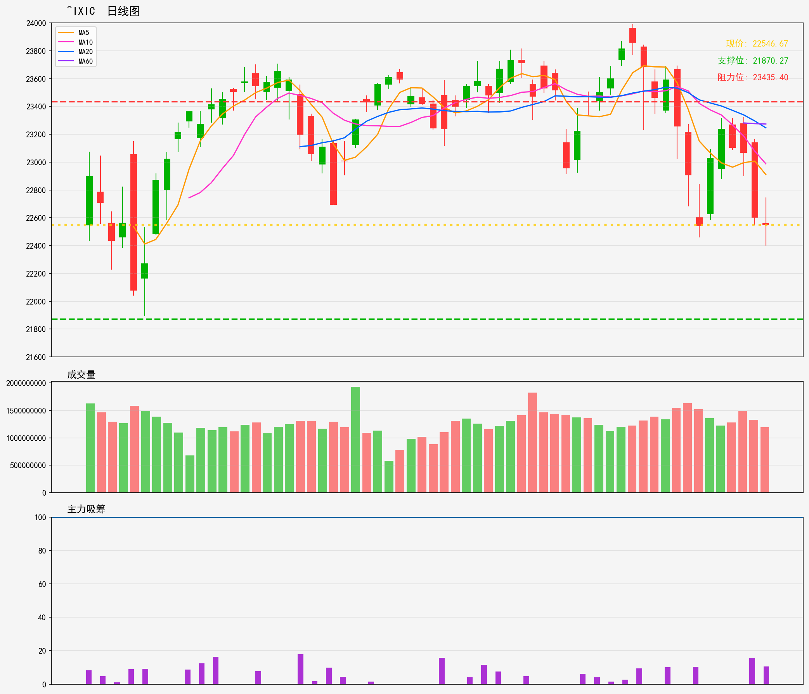

# 美股 - 市场指数
## ^IXIC 技術分析報告
**生成時間**: 20260216

### 📊 核心技術指標
- 最新價格: 22546.67
- 技術趨勢: 下降趋势
- MA20: 23246.49 | MA60: 23273.62
- RSI(14): 33.6 (中性)
- 支撑位: 21870.27 | 阻力位: 23435.4

### 📝 AI超短線分析 (1-5日)
1. 趨勢總結：短期處下降趨勢，價格低於MA20、MA60，弱勢格局明顯；RSI33.6接近超賣區但未進入，暫未見明顯反轉信號。
2. 勝率：空頭勝率約60%，多頭反彈勝率約40%——趨勢向下為主導，但RSI接近超賣給予短線反彈空間，惟力度料有限。
3. 情景分析：① 若反彈突破23435阻力，或短線反抽至MA20（23246）附近後遇壓回落；② 若跌破21870支撐，則進一步下探空間打開；③ 若在21870-23435區間震盪，以弱勢整理為主，反彈高度受限。
4. 交易建議：短空策略：在23000-23200區間（MA20下方）輕倉佈空，止損設23450，目標看21870；短多策略：僅在21870支撐位輕倉試多，止損21600，目標22800-23000，獲利即走；震盪期優先觀望，勿追漲殺跌。

### 🎧 語音版本
- 粵語版: [^IXIC_cantonese_20260216.mp3](audio/^IXIC_cantonese_20260216.mp3)
- 普通話版: [^IXIC_mandarin_20260216.mp3](audio/^IXIC_mandarin_20260216.mp3)

---

# US Stocks - Market Index
## ^IXIC Technical Analysis Report
**Generated Time**: 20260216

### 📊 Core Technical Indicators
- Current Price: 22546.67
- Technical Trend: Downtrend
- MA20: 23246.49 | MA60: 23273.62
- RSI(14): 33.6 (Neutral)
- Support Level: 21870.27 | Resistance Level: 23435.4

### 📝 AI Short-Term Analysis (1-5 Days)
1. Trend Summary  
Confirmed short-term downtrend. Current price (22546.67) trades below both MA20 (23246.49) and MA60 (23273.62), reinforcing bearish momentum. RSI at 33.6 is near the oversold threshold (30) but not yet oversold, signaling weak buying pressure with potential for a technical bounce. Key support: 21870.27; resistance: 23435.40.

2. Win Rate  
58% for bearish positions (shorting/defensive holds). The dominant downtrend and below-MA placement favor bearish plays, but the near-oversold RSI introduces moderate risk of a temporary counter-trend bounce, slightly reducing win probability.

3. Scenario Analysis  
- Bullish Scenario: A technical bounce triggers if the index holds support (21870.27) or RSI dips to 30. Could rally to test MA20 (23246.49) within 3-5 days, confirmed by a daily close above 22800 with rising volume.  
- Bearish Scenario: Continued selling breaks below 21870.27, extending the downtrend. Targets next near-term support (~21500), confirmed by a daily close below support with above-average volume.

4. Trading Advice  
- Aggressive Traders: Avoid heavy shorting at current levels (near oversold RSI). Enter short positions only on a daily close below 21870.27, with stop-loss at 22200 and target 21500.  
- Conservative Traders: Hold cash or light short positions. If a bounce confirms (close above 22800), take a small long position with stop-loss at 22300 and target 23200 (MA20).  
- All Traders: Monitor RSI closely— a drop below 30 increases bounce likelihood, while a support break solidifies the downtrend.

### 🎧 Audio Version
- English Version: [^IXIC_english_20260216.mp3](audio/^IXIC_english_20260216.mp3)