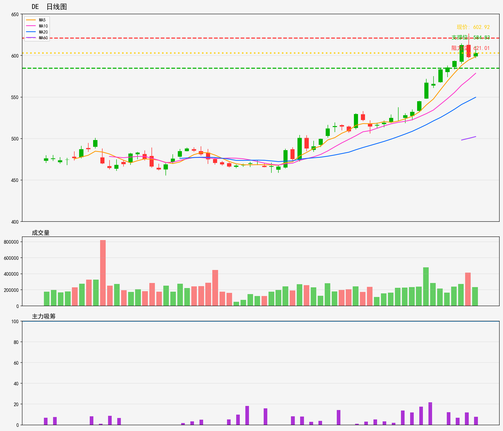

# 美股 - 强势趋势股
## DE 技術分析報告
**生成時間**: 20260216

### 📊 核心技術指標
- 最新價格: 602.92
- 技術趨勢: 上升趋势
- MA20: 549.72 | MA60: 502.33
- RSI(14): 85.2 (超买)
- 支撑位: 584.83 | 阻力位: 621.01

### 📝 AI超短線分析 (1-5日)
1. 趨勢總結：大趨勢向上，MA20、MA60於現價下方提供支撐，但RSI達85.2嚴重超買，短期回調壓力大，上衝動能減弱。
2. 勝率：50%（上升趨勢支撐強，但超買風險高，兩因素拉扯導致方向不明朗）
3. 情景分析：
   - 突破阻力621：升勢延續，短期目標看630附近；
   - 回測支撐584.83：守穩則反彈，跌破則下探MA20（約550）。
4. 交易建議：暫勿追高，等待回調至584-590區間小倉進場，止損設578，目標看615-620；若直接突破621並站穩，可輕倉跟進，止損615，目標630，全程倉位控制在2成以內。

### 🎧 語音版本
- 粵語版: [DE_cantonese_20260216.mp3](audio/DE_cantonese_20260216.mp3)
- 普通話版: [DE_mandarin_20260216.mp3](audio/DE_mandarin_20260216.mp3)

---

# US Stocks - Strong Trend Stocks
## DE Technical Analysis Report
**Generated Time**: 20260216

### 📊 Core Technical Indicators
- Current Price: 602.92
- Technical Trend: Uptrend
- MA20: 549.72 | MA60: 502.33
- RSI(14): 85.2 (Overbought)
- Support Level: 584.83 | Resistance Level: 621.01

### 📝 AI Short-Term Analysis (1-5 Days)
1. Trend Summary  
Strong medium-to-short-term uptrend confirmed by MA20 (549.72) trading well above MA60 (502.33). However, extreme overbought RSI (85.2) signals high risk of a pullback or consolidation in the 1-5 day window, despite broader upward momentum.

2. Win Rate  
- Fresh long entries now: 30-35% (low, due to overbought pressure)  
- Short-term bearish setups (resistance rejection): 60-65% (high, as pullback risk outweighs further upside)  
- Breakout longs above 621.01: 45-50% (moderate, sustained overbought conditions are rare short-term)

3. Scenario Analysis  
- Scenario 1 (65% probability, Likely): Price tests resistance at 621.01 and rejects, triggering a pullback to support at 584.83. If selling momentum accelerates, price may retest MA20 (549.72) within 3-5 days.  
- Scenario 2 (35% probability, Less Likely): Bullish momentum persists, pushing price above 621.01 resistance to new highs. RSI remains overbought temporarily before a consolidation phase.

4. Trading Advice  
- Avoid new long entries at current levels due to extreme RSI.  
- Existing long holders: Take 50-60% partial profits and set a trailing stop-loss at $590 to lock in gains.  
- Aggressive traders: Enter short positions on a clear rejection at $621.01 (e.g., shooting star candlestick) with stop-loss above $625, target $584.83.  
- Wait for a pullback to $584.83 with RSI cooling to 70 or below before considering new long entries for favorable risk-reward.

### 🎧 Audio Version
- English Version: [DE_english_20260216.mp3](audio/DE_english_20260216.mp3)