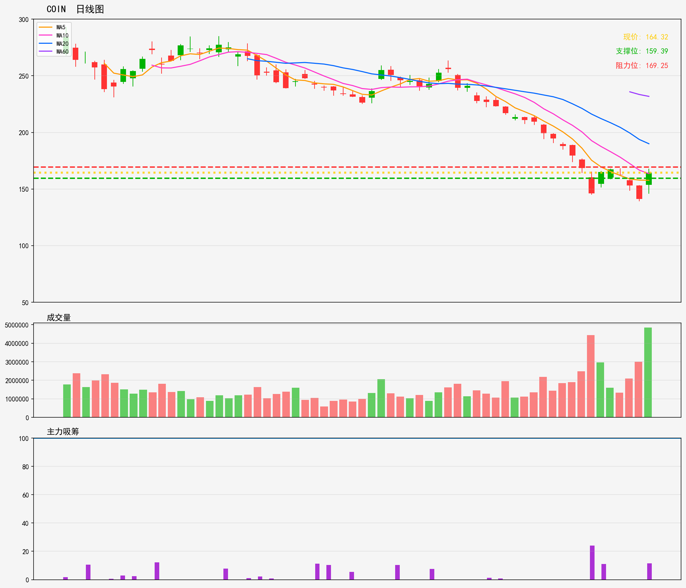

# 美股 - 观察列表
## COIN 技術分析報告
**生成時間**: 20260216

### 📊 核心技術指標
- 最新價格: 164.32
- 技術趨勢: 下降趋势
- MA20: 189.97 | MA60: 231.78
- RSI(14): 32.2 (中性)
- 支撑位: 159.39 | 阻力位: 169.25

### 📝 AI超短線分析 (1-5日)
1. 趨勢總結：大趨勢向下，股價遠低於MA20同MA60，屬弱勢格局；RSI32.2處中性區，暫未見超賣反彈信號。
2. 勝率：勝率約45%，弱勢下反彈動力不足，跌破支撐風險高於觸及阻力機會。
3. 情景分析：
- 突破169.25阻力：短線或反彈至MA20附近（約190），但大趨勢向下，續升空間有限；
- 跌破159.39支撐：進一步下探，下一目標關注150水平；
- 震盪情景：於159.39-169.25區間橫行，弱勢震盪後向下概率偏高。
4. 交易建議：
- 持倉者：於169.25阻力位附近止盈減倉，避免高位被套；
- 空單布局：可在169.25下方輕倉建空，止損設171上方；跌破159.39後加倉空單，止損161上方；
- 未持倉者：建議觀望為主，待出現明顯反轉信號（如站穩170超過1個交易日）再考慮介入。

### 🎧 語音版本
- 粵語版: [COIN_cantonese_20260216.mp3](audio/COIN_cantonese_20260216.mp3)
- 普通話版: [COIN_mandarin_20260216.mp3](audio/COIN_mandarin_20260216.mp3)

---

# US Stocks - Watch List
## COIN Technical Analysis Report
**Generated Time**: 20260216

### 📊 Core Technical Indicators
- Current Price: 164.32
- Technical Trend: Downtrend
- MA20: 189.97 | MA60: 231.78
- RSI(14): 32.2 (Neutral)
- Support Level: 159.39 | Resistance Level: 169.25

### 📝 AI Short-Term Analysis (1-5 Days)
1. Trend Summary  
Dominant short-term downtrend. Current price ($164.32) trades far below MA20 ($189.97) and MA60 ($231.78), confirming strong bearish momentum. RSI at 32.2 is near oversold levels but hasn’t triggered a reversal signal. Immediate support at $159.39, resistance at $169.25.

2. Win Rate  
55% for bearish short-term setups; 40% for bullish countertrend plays (downtrend bias limits upside reliability).

3. Scenario Analysis  
- Bullish: Price holds $159.39 support, RSI rises above 35. Expect a limited bounce to $169.25 resistance, capped by MA20 overhead pressure.  
- Bearish: Price breaks below $159.39 (with volume confirmation) → next short-term target $150. Alternatively, rejection at $169.25 triggers a retest of $159.39, followed by further downside.

4. Trading Advice  
Prioritize short entries on rejection at $169.25 (stop loss: $172, targets: $159.39 → $150). For countertrend longs, only enter if price holds $159.39 and RSI crosses 35 (stop loss: $157, target: $169.25). Exit all positions within 5 days to avoid prolonged downtrend exposure.

### 🎧 Audio Version
- English Version: [COIN_english_20260216.mp3](audio/COIN_english_20260216.mp3)