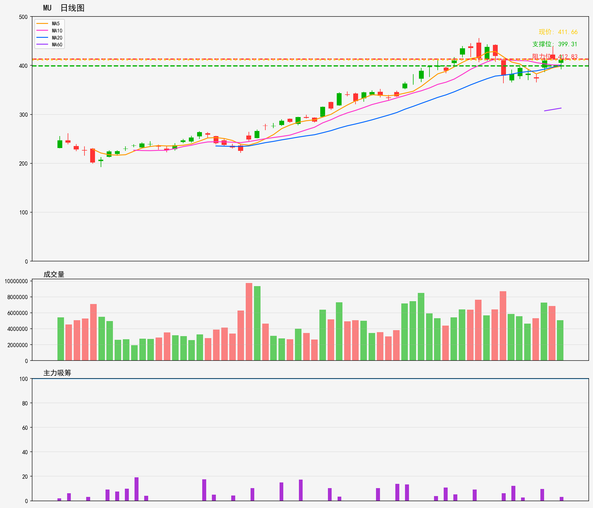

# 美股 - 观察列表
## MU 技術分析報告
**生成時間**: 20260216

### 📊 核心技術指標
- 最新價格: 411.66
- 技術趨勢: 上升趋势
- MA20: 400.32 | MA60: 312.81
- RSI(14): 54.9 (中性)
- 支撑位: 399.31 | 阻力位: 412.83

### 📝 AI超短線分析 (1-5日)
1. 趨勢總結：大趨勢向上，MA20、MA60於現價下方提供支撐，唯現價貼近短期阻力412.83，RSI處中性區，短期上攻動能不算強勁。
2. 勝率：6成
3. 情景分析：
- 若突破412.83並穩企，短期有望衝擊420水平；
- 若受阻回落，先看399.31支撐，破位則短期走弱風險上升。
4. 交易建議：暫勿追高，待回調至400-402區間輕倉進場，止損設397，止盈看420；若直接突破阻力並回踩確認，亦可小倉跟進，獲利5-8%即止。

### 🎧 語音版本
- 粵語版: [MU_cantonese_20260216.mp3](audio/MU_cantonese_20260216.mp3)
- 普通話版: [MU_mandarin_20260216.mp3](audio/MU_mandarin_20260216.mp3)

---

# US Stocks - Watch List
## MU Technical Analysis Report
**Generated Time**: 20260216

### 📊 Core Technical Indicators
- Current Price: 411.66
- Technical Trend: Uptrend
- MA20: 400.32 | MA60: 312.81
- RSI(14): 54.9 (Neutral)
- Support Level: 399.31 | Resistance Level: 412.83

### 📝 AI Short-Term Analysis (1-5 Days)
1. Trend Summary  
Short-term uptrend remains intact. Current price ($411.66) hovers just below immediate resistance ($412.83). MA20 ($400.32) acts as critical near-term support, while MA60 ($312.81) confirms strong long-term upward momentum. Neutral RSI (54.9) shows no overbought/oversold signals, leaving room for further price movement.

2. Win Rate  
65%: Uptrend bias supports bullish moves, but proximity to resistance introduces minor pullback risk. Strong MA20 support limits downside, while neutral RSI avoids extreme directional bias, tilting odds slightly in favor of bullish outcomes.

3. Scenario Analysis  
- Bullish: Break above $412.83 with 15%+ above-average volume triggers upside to $420 in 1-3 days.  
- Bearish: Failure to breach resistance leads to a pullback to MA20 ($400.32) in 2-4 days; a break below $399.31 support could extend losses to $395.

4. Trading Advice  
- Existing longs: Lock in 20% of profits if price stalls at $412.83; set stop-loss at $399.31 to limit downside.  
- New entries: Wait for a confirmed breakout above $412.83 (with volume) to go long, targeting $420 and stop-loss at $408. Alternatively, enter on a pullback to $400-$401 (MA20 zone) with stop-loss at $398. Avoid short positions amid the dominant uptrend.

### 🎧 Audio Version
- English Version: [MU_english_20260216.mp3](audio/MU_english_20260216.mp3)