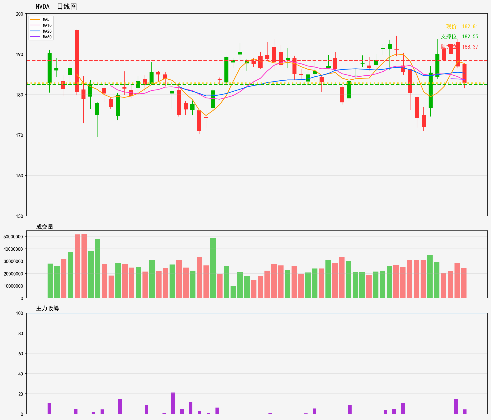

# 美股 - 观察列表
## NVDA 技術分析報告
**生成時間**: 20260216

### 📊 核心技術指標
- 最新價格: 182.81
- 技術趨勢: 横盘整理
- MA20: 185.30 | MA60: 183.78
- RSI(14): 46.7 (中性)
- 支撑位: 182.55 | 阻力位: 188.37

### 📝 AI超短線分析 (1-5日)
1. 趨勢總結：現處橫盤整理態勢，現價182.81位於MA60（183.78）下方、MA20（185.30）更在上方，RSI46.7屬中性，整體維持區間震盪格局。
2. 勝率：50%（橫盤方向不明，中性市況勝率持平）
3. 情景分析：
   - 情景1：突破阻力188.37且收穩，短線有望反彈，目標看190上方；
   - 情景2：跌破支撐182.55，則可能測試180-181區域；
   - 情景3：區間內震盪，則在182.55-188.37之間來回波動。
4. 交易建議：
   - 區間內：183-184輕倉做空，止損188.5；182.6-183輕倉做多，止損182.4；
   - 突破188.37追多，止損187；
   - 跌破182.55反手做空，止損183。

### 🎧 語音版本
- 粵語版: [NVDA_cantonese_20260216.mp3](audio/NVDA_cantonese_20260216.mp3)
- 普通話版: [NVDA_mandarin_20260216.mp3](audio/NVDA_mandarin_20260216.mp3)

---

# US Stocks - Watch List
## NVDA Technical Analysis Report
**Generated Time**: 20260216

### 📊 Core Technical Indicators
- Current Price: 182.81
- Technical Trend: Sideways Trend
- MA20: 185.30 | MA60: 183.78
- RSI(14): 46.7 (Neutral)
- Support Level: 182.55 | Resistance Level: 188.37

### 📝 AI Short-Term Analysis (1-5 Days)
1. Trend Summary  
NVDA is in a tight 1-5 day sideways consolidation (182.55–188.37). Current price (182.81) hovers just above immediate support (182.55) and below MA60 (183.78) and MA20 (185.30). RSI (46.7) is neutral, showing no strong bullish or bearish momentum. The range is well-defined but lacks a clear directional bias.  

2. Win Rate  
55-60% for short-term trades. Defined support/resistance levels provide clear entry/exit rules, but neutral RSI and sideways price action limit strong momentum edges. Success relies on timely entries at range extremes and quick confirmation of breakouts/breakdowns.  

3. Scenario Analysis  
- **Bullish Scenario**: Price breaks above MA60 (183.78) on 10% above average volume. Triggers could include positive AI sector news, institutional accumulation, or broad tech strength. Target: 188.37 (resistance) in 3-5 days. Stop-loss: Below 182.55 to cap downside.  
- **Bearish Scenario**: Price breaks below 182.55 with increased selling volume. Triggers may include profit-taking, hawkish Fed comments, or semiconductor sector weakness. Target: 179 (near-term support zone) in 2-4 days. Stop-loss: Above MA20 (185.30).  
- **Sideways Scenario**: Price oscillates between 182.55 and 183.78 with no clear break. Likely if market sentiment stays mixed. No directional trade opportunity—wait for confirmation of a range break.  

4. Trading Advice  
- **Range-bound strategy**: Go long only if price bounces off 182.55 with bullish candlestick confirmation (e.g., hammer) and volume pickup. Target 188.37, stop-loss at 182.00.  
- **Short setup**: Enter short only if price breaks below 182.55 on heavy volume. Target 179.00, stop-loss at 185.50.  
- Avoid trades while price is stuck between 182.55 and 183.78 to reduce false signals. Keep position sizes moderate (1-2% of portfolio) due to the moderate win rate and limited momentum.

### 🎧 Audio Version
- English Version: [NVDA_english_20260216.mp3](audio/NVDA_english_20260216.mp3)