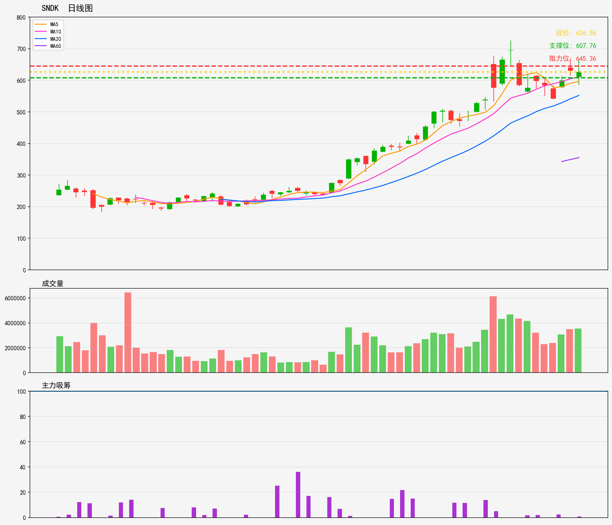

# 美股 - 观察列表
## SNDK 技術分析報告
**生成時間**: 20260216

### 📊 核心技術指標
- 最新價格: 626.56
- 技術趨勢: 上升趋势
- MA20: 552.07 | MA60: 355.25
- RSI(14): 65.1 (中性)
- 支撑位: 607.76 | 阻力位: 645.36

### 📝 AI超短線分析 (1-5日)
1. 趨勢總結：短期上升趨勢清晰，現價遠高於MA20同MA60，均線呈多頭排列；RSI65.1處中性偏強水平，暫未超買，上升動能仍存。
2. 勝率：70%
3. 情景分析：
- 突破情景：若放量突破645.36阻力，短期上升動能加強，有望進一步衝高；
- 回調情景：若遇阻回落，測試607.76支撐，守住則反彈機會大，破位則短期轉弱。
4. 交易建議：現價附近輕倉介入，止損設於607.76下方（如605），目標先看645.36，突破則持有看更高；或等回調至607.76支撐確認企穩再進場，風險更低。

### 🎧 語音版本
- 粵語版: [SNDK_cantonese_20260216.mp3](audio/SNDK_cantonese_20260216.mp3)
- 普通話版: [SNDK_mandarin_20260216.mp3](audio/SNDK_mandarin_20260216.mp3)

---

# US Stocks - Watch List
## SNDK Technical Analysis Report
**Generated Time**: 20260216

### 📊 Core Technical Indicators
- Current Price: 626.56
- Technical Trend: Uptrend
- MA20: 552.07 | MA60: 355.25
- RSI(14): 65.1 (Neutral)
- Support Level: 607.76 | Resistance Level: 645.36

### 📝 AI Short-Term Analysis (1-5 Days)
### 1. Trend Summary  
Confirmed short/medium-term uptrend: Price trades well above MA20 (552.07) and MA60 (355.25), with no signs of a trend reversal yet. RSI at 65.1 is neutral, leaning slightly toward overbought but not extreme. Immediate support sits at 607.76, and near-term resistance is 645.36.  

### 2. Win Rate  
65% for long positions targeting resistance (645.36) over 1-5 days. The intact uptrend and nearby support limit downside risk, but proximity to resistance and RSI’s upward tilt reduce upside certainty.  

### 3. Scenario Analysis  
- **Bullish**: Price breaks above 645.36 with 1.5x+ average volume, triggering a 2-3% rally to ~660. Likely driven by company-specific catalysts (e.g., earnings beats) or broad tech sector momentum.  
- **Bearish**: Fails to breach resistance, pulling back to 607.76 support. A hold at support presents a low-risk buying opportunity; a break below 600 signals temporary trend weakness, with next near-term support at MA20 (552.07).  

### 4. Trading Advice  
- **Long Entry**: Enter at current price (626.56) or on a pullback to 607.76-610.  
- **Stop Loss**: Place below 600 to avoid whipsaws from minor support tests.  
- **Target**: Exit at 645.36 resistance; if resistance breaks, trail stop loss to 635 to lock in further gains.  
- **Avoid Shorts**: Uptrend remains intact, and RSI hasn’t hit overbought levels to validate high-probability short setups.

### 🎧 Audio Version
- English Version: [SNDK_english_20260216.mp3](audio/SNDK_english_20260216.mp3)