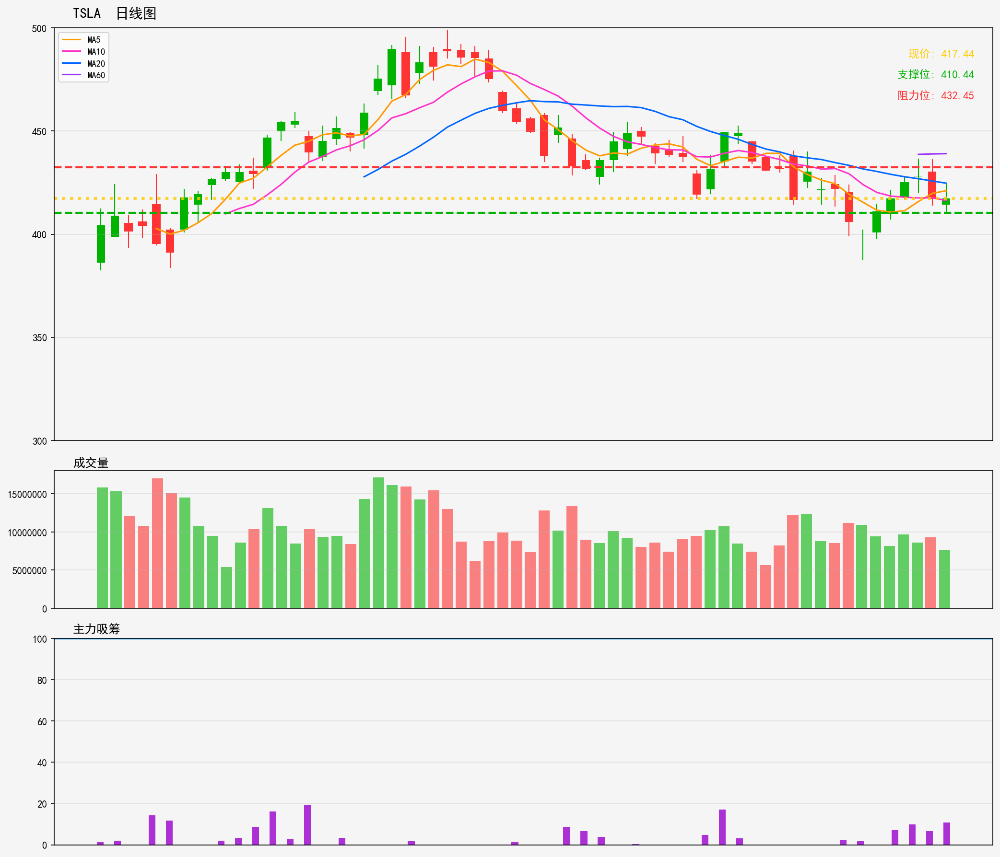

# 美股 - 观察列表
## TSLA 技術分析報告
**生成時間**: 20260216

### 📊 核心技術指標
- 最新價格: 417.44
- 技術趨勢: 下降趋势
- MA20: 424.73 | MA60: 439.04
- RSI(14): 41.9 (中性)
- 支撑位: 410.44 | 阻力位: 432.45

### 📝 AI超短線分析 (1-5日)
1. 趨勢總結：短期處於下降趨勢，現價低於MA20、MA60，均線構成明顯壓制，RSI處中性區間，暫未見明顯轉強信號。
2. 勝率：做空勝率約65%，做多勝率約35%，下降趨勢背景下做空更具超短線優勢。
3. 情景分析：
- 跌破410.44支撐：確認趨勢延續，下探空間打開，目標可看400-405區間；
- 反彈突破MA20（424.73）：或挑戰432.45阻力，但大趨勢向下，反彈力度料有限；
- 橫盤震盪：在410-424區間徘徊，暫無明確方向，不宜輕易進場。
4. 交易建議：
- 優先逢高做空：420-424區間（MA20附近）建空單，止損設433上方，目標410，跌破後跟進下看405；
- 跌破支撐追空：有效跌破410.44時輕倉追空，止損415上方，目標405；
- 做多極度謹慎：僅價格突破424.73並連續2小時站穩，才可輕倉試多，止損420下方，目標432。

### 🎧 語音版本
- 粵語版: [TSLA_cantonese_20260216.mp3](audio/TSLA_cantonese_20260216.mp3)
- 普通話版: [TSLA_mandarin_20260216.mp3](audio/TSLA_mandarin_20260216.mp3)

---

# US Stocks - Watch List
## TSLA Technical Analysis Report
**Generated Time**: 20260216

### 📊 Core Technical Indicators
- Current Price: 417.44
- Technical Trend: Downtrend
- MA20: 424.73 | MA60: 439.04
- RSI(14): 41.9 (Neutral)
- Support Level: 410.44 | Resistance Level: 432.45

### 📝 AI Short-Term Analysis (1-5 Days)
1. Trend Summary  
Short-term (1-5 days) downtrend is intact: TSLA trades below MA20 ($424.73) and MA60 ($439.04), confirming bearish momentum. RSI at 41.9 is neutral—no extreme oversold conditions, so downside pressure remains but lacks panic-selling intensity. Price is trapped between immediate support ($410.44) and resistance ($432.45).  

2. Win Rate  
65% for trend-aligned short positions (betting on downside); 35% for counter-trend long positions (downtrend acts as a strong headwind).  

3. Scenario Analysis  
- Bearish Scenario (Likely): Price slides to test $410.44 support within 2-3 days. A volume-driven break below this level could extend downside to $400-$405 by day 5, fueled by continued profit-taking or weak market sentiment.  
- Bullish Scenario (Low Probability): Unexpected positive catalysts (e.g., delivery guidance leaks, AI project updates) push price above MA20 ($424.73) with volume. This triggers a bounce to test $432.45 resistance in 4-5 days, though sustainability is limited by the broader downtrend.  

4. Trading Advice  
- Preferred Setup (Short): Enter short at $417.44 or on a bounce to $422-$424 (near MA20). Place stop-loss above $432.45 to cap upside risk. Take 50% profit at $410.44; trail stop to breakeven if price breaks below support to capture further downside.  
- Counter-Trend Long (High Risk): Only enter if price bounces off $410.44 with strong volume and RSI rises above 45. Use a small position size (<10% of portfolio), set stop-loss below $408, and target $424.73 (MA20) for a quick exit.

### 🎧 Audio Version
- English Version: [TSLA_english_20260216.mp3](audio/TSLA_english_20260216.mp3)